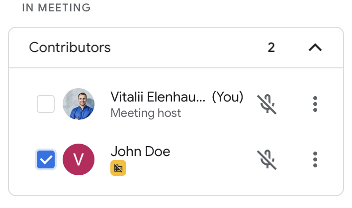

# Google Meet Checklist

A chrome extension that adds persisted (to local stage) checkboxes in front of participant list.



## Packing

After the development of your extension run the command

```shell
$ npm install
$ npm run build
```

Now, the content of `build` folder will be the extension ready to be submitted to the Chrome Web Store. Just take a look at the [official guide](https://developer.chrome.com/webstore/publish) to more infos about publishing.


### Chrome Extension Developer Mode

1. set your Chrome browser 'Developer mode' up
2. click 'Load unpacked', and select `google-meet-checklist/build` folder
